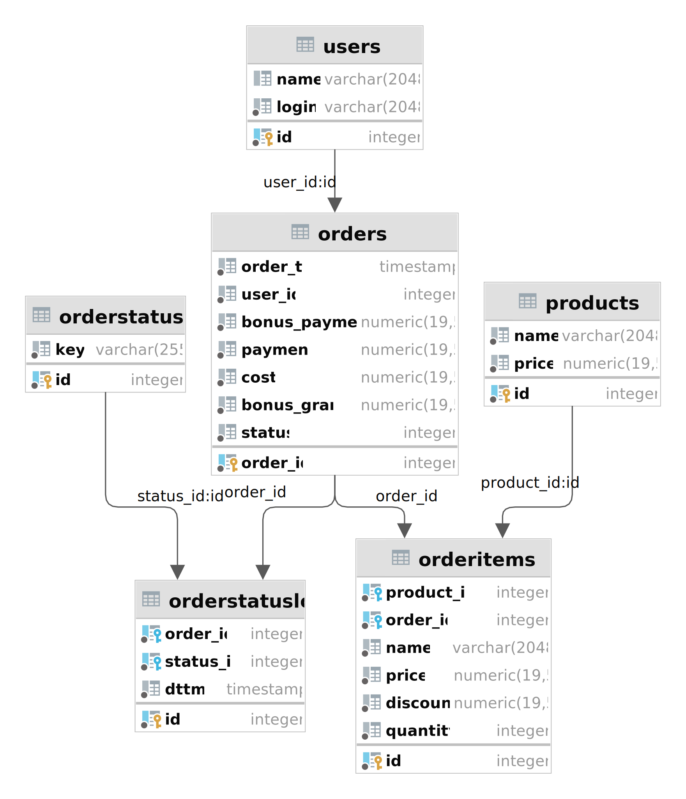

# Проект 1



## 1.2

<hr>

Посмотрев на ER диаграмму можно понять что типы статусов храняться в таблице
```orderstatuses``` и находим в нем какой id у ```Cancelled``` чтоб можно было
достать только успешные заказы.

| id | key |
|:----:| :--- |
| 1 | Open |
| 2 | Cooking |
| 3 | Delivering |
| 4 | Closed |
| 5 | Cancelled |

Как мы видим ```id=4``` это статус ```Closed```

## Изучите структуру исходных данных И Проанализируйте качество данных

<hr>
Начнем с проверки 
заказов. Будем иметь ввиду что заказ во время cooking и delivering
отменить нельзя. Получается заказ должен быть Open и только потом может быть Cancelled
И тут мы проверим нет ли таких заказов из за Багов в приложении

```postgresql
with orders_prev_stat as (select order_id,
                                 key                                                          status,
                                 dttm,
                                 lag(key, 1, null) over (partition by order_id order by dttm) prev_status
                          from orderstatuslog ol
                                   join orderstatuses o on ol.status_id = o.id
                          order by order_id)
select *
from orders_prev_stat
where status = 'Cancelled'
  and prev_status != 'Open'
```

| order\_id | status | dttm | prev\_status |
| :--- | :--- | :--- | :--- |

Видим что с заказами все в порядке.

<hr>

В таблице orders ```user_id``` не ```FK```. Это значит что в
базе может быть заказы без юзера, давайте проверим наличие
таких заказов

```postgresql
select order_id
from orders
where user_id not in (select user_id from users);
```

| order\_id |
| :--- |

Есть ли заказы юзеров которых нет в нашей таблице.
Через 2й запрос можно точно выявить поврежденные заказа
но как мы видим их нет. Но нужно исправить это чтоб ```user_id``` указал на ```users.user_id```

<hr>

Дальше можно проверить нет ли отрицательных значений в такиз полях
как bonus_payment/payment/cost/bonus_grant.

<hr>

### Про существующие ограничения

В ```orders``` есть ```constraint orders_check
check (cost = (payment + bonus_payment))``` так что
не придеться нам самим проверить

<hr>

Продукты не должны иметь отрицательные цены
```constraint products_price_check check (price >= (0)::numeric)```
<hr>

В ```orderstatuslog``` стоит
```unique (order_id, status_id)``` то есть
у заказа не может быть два одинаковых статуса одновременно

<hr>

И еще в ```orderitems``` можем увидеть что при добавлении одного и того же
товара оно не должно дублироваться а наобарот увеличить счетчик на единицу.
И как упомянулось ранее сумма их цен !< 0
Скидка больше 0 и не должна перевышать цену товара, так как ценнык не может иметь
отрацательное значение

```
price      numeric(19, 5) default 0 not null
        constraint orderitems_price_check
            check (price >= (0)::numeric),
    discount   numeric(19, 5) default 0 not null,
    quantity   integer                  not null
        constraint orderitems_quantity_check
            check (quantity > 0),
    unique (order_id, product_id),
    constraint orderitems_check
        check ((discount >= (0)::numeric) AND (discount <= price))
```

<hr>

Было бы хорошо если у юзера ```name``` был обязательным, то есть ```not null```

<hr>

# Подготовьте витрину данных

В файле ```views_ddl.sql``` скрипты для создания представлений для
каждой таблицы из ```production```

<hr>

Создадим витрину. Лучше сделать user_id сразу PK, так как он тут distinct

```postgresql
create table dm_rfm_segments
(
    user_id        int primary key,
    recency        int check ( recency in (1, 2, 3, 4, 5) ),
    frequency      int check ( frequency in (1, 2, 3, 4, 5) ),
    monetary_value int check ( monetary_value in (1, 2, 3, 4, 5) )
)
```

<hr>

## Как провести RFM-сегментацию

Сперва нужно достать из базы успешные(Closed) заказы с начала 2021 года
```postgresql
with gte_2021_closed_orders as (select o.order_id, user_id, payment, order_ts
                                from orderstatuslog ol
                                         join orders o on ol.order_id = o.order_id
                                where status_id = 4
                                  and extract(year from order_ts) >= 2021)
```

И перед тем как мержить все в единый запрос давайте проверим что
количество клиентов в каждом сегменте одинаково. Тут я решил пользоваться
подзапросом ради чатаемости, так как оно кэшируется и не выполняется
при каждой итерации

```postgresql
with gte_2021_closed_orders as (select o.order_id
                                from orderstatuslog ol
                                         join orders o on ol.order_id = o.order_id
                                where status_id = 4
                                  and extract(year from order_ts) >= 2021),
     u_recency as (select user_id, now() - max(order_ts) last_order_was
                   from orders o
                            right join users u on o.user_id = u.id
                   where o.order_id in (select * from gte_2021_closed_orders)
                   group by user_id),
     tmp as (select user_id, last_order_was, ntile(5) over (order by last_order_was desc) recency
                     from u_recency
                     order by recency desc)
select recency, count(user_id)
from tmp
group by recency
```

| recency | count |
| :--- | :--- |
| 3 | 198 |
| 5 | 197 |
| 4 | 197 |
| 2 | 198 |
| 1 | 198 |

```postgresql
with gte_2021_closed_orders as (select o.order_id
                                from orderstatuslog ol
                                         join orders o on ol.order_id = o.order_id
                                where status_id = 4
                                  and extract(year from order_ts) >= 2021),
     u_monetary as (select user_id, sum(payment) spent
                    from orders o
                             join users u on o.user_id = u.id
                    where o.order_id in (select * from gte_2021_closed_orders)
                    group by user_id),
     tmp as (select user_id, spent, ntile(5) over (order by spent) monetary
                      from u_monetary)

select monetary, count(user_id)
from tmp
group by monetary
```

| monetary | count |
| :--- | :--- |
| 3 | 198 |
| 5 | 197 |
| 4 | 197 |
| 2 | 198 |
| 1 | 198 |

```postgresql
with gte_2021_closed_orders as (select o.order_id
                                from orderstatuslog ol
                                         join orders o on ol.order_id = o.order_id
                                where status_id = 4
                                  and extract(year from order_ts) >= 2021),
     u_frequency as (select user_id, count(order_id) order_cnt
                     from orders o
                              join users u on o.user_id = u.id
                     where o.order_id in (select * from gte_2021_closed_orders)
                     group by user_id),

     tmp as (select user_id, order_cnt, ntile(5) over (order by order_cnt desc) frequency
                       from u_frequency
                       order by order_cnt desc, user_id)

select frequency, count(user_id)
from tmp
group by frequency
```

| frequency | count |
| :--- | :--- |
| 3 | 198 |
| 5 | 197 |
| 4 | 197 |
| 2 | 198 |
| 1 | 198 |

Как мы видим во всех случаях данные распределены почти равномерно

### Тепер будем подробно разбирать по одному все кейсы
Recency мы получаем по этой локике

```postgresql
with gte_2021_closed_orders as (select o.order_id, user_id, payment, order_ts
                                from orderstatuslog ol
                                         join orders o on ol.order_id = o.order_id
                                where status_id = 4
                                  and extract(year from order_ts) >= 2021),
     u_recency as (select user_id, now() - max(order_ts) last_order_was
                   from gte_2021_closed_orders o
                            right join users u on o.user_id = u.id
                   group by user_id)
select user_id, last_order_was, ntile(5) over (order by last_order_was desc) recency
from u_recency
order by recency desc
limit 10;
```

| user\_id | last\_order\_was | recency |
| :--- | :--- | :--- |
| 810 | 0 years 0 mons 42 days 19 hours 23 mins 6.729532 secs | 5 |
| 734 | 0 years 0 mons 42 days 18 hours 40 mins 21.729532 secs | 5 |
| 16 | 0 years 0 mons 42 days 19 hours 45 mins 36.729532 secs | 5 |
| 421 | 0 years 0 mons 42 days 19 hours 31 mins 26.729532 secs | 5 |
| 600 | 0 years 0 mons 42 days 19 hours 13 mins 31.729532 secs | 5 |
| 330 | 0 years 0 mons 42 days 18 hours 44 mins 1.729532 secs | 5 |
| 22 | 0 years 0 mons 42 days 20 hours 3 mins 46.729532 secs | 5 |
| 680 | 0 years 0 mons 42 days 20 hours 1 mins 6.729532 secs | 5 |
| 201 | 0 years 0 mons 42 days 19 hours 36 mins 9.729532 secs | 5 |
| 299 | 0 years 0 mons 42 days 18 hours 19 mins 49.729532 secs | 5 |

Тепер frequency

```postgresql
with gte_2021_closed_orders as (select o.order_id, user_id, payment, order_ts
                                from orderstatuslog ol
                                         join orders o on ol.order_id = o.order_id
                                where status_id = 4
                                  and extract(year from order_ts) >= 2021),
     u_frequency as (select user_id, count(order_id) orders_cnt
                     from gte_2021_closed_orders o
                              join users u on o.user_id = u.id
                     group by user_id)
select user_id, orders_cnt, ntile(5) over (order by orders_cnt) frequency
from u_frequency
order by orders_cnt desc, user_id
limit 10;
```
| user\_id | orders\_cnt | frequency |
| :--- | :--- | :--- |
| 684 | 15 | 5 |
| 65 | 12 | 5 |
| 330 | 12 | 5 |
| 488 | 12 | 5 |
| 517 | 12 | 5 |
| 540 | 12 | 5 |
| 788 | 12 | 5 |
| 56 | 11 | 5 |
| 105 | 11 | 5 |
| 184 | 11 | 5 |

И monetary 

```postgresql
with gte_2021_closed_orders as (select o.order_id, user_id, payment, order_ts
                                from orderstatuslog ol
                                         join orders o on ol.order_id = o.order_id
                                where status_id = 4
                                  and extract(year from order_ts) >= 2021),
     u_monetary as (select user_id, sum(payment) spent
                    from gte_2021_closed_orders o
                             join users u on o.user_id = u.id
                    group by user_id)
select user_id, spent, ntile(5) over (order by spent) monetary
from u_monetary
order by spent desc;
```
| user\_id | spent | monetary |
| :--- | :--- | :--- |
| 684 | 37500 | 5 |
| 563 | 36840 | 5 |
| 940 | 31980 | 5 |
| 735 | 31320 | 5 |
| 725 | 29640 | 5 |
| 755 | 29580 | 5 |
| 387 | 29340 | 5 |
| 56 | 29040 | 5 |
| 788 | 28980 | 5 |
| 858 | 28800 | 5 |

<hr>

И сольем все в один запрос

```postgresql
with gte_2021_closed_orders as (select o.order_id, user_id, payment, order_ts
                                from analysis.orderstatuslog ol
                                         join analysis.orders o on ol.order_id = o.order_id
                                where status_id = 4
                                  and extract(year from order_ts) >= 2021),
     tmp as (select distinct u.id                                                       as user_id,
                             coalesce(extract(epoch from max(order_ts) over (partition by u.id)), 0) as last_order_was,
                             count(order_id) over (partition by u.id)                   as orders_cnt,
                             coalesce(sum(payment) over (partition by u.id), 0)         as spent
             from analysis.users u
                      left join gte_2021_closed_orders on u.id = gte_2021_closed_orders.user_id)
select user_id,
       last_order_was,
       ntile(5) over (order by last_order_was) as recency,
       orders_cnt,
       ntile(5) over (order by orders_cnt )         as frequency,
       spent,
       ntile(5) over (order by spent)               as monetary_value
from tmp
order by last_order_was
```
# По подсказмам упростил запрос

| user\_id | last\_order\_was | recency | orders\_cnt | frequency | spent | monetary\_value |
| :--- | :--- | :--- | :--- | :--- | :--- | :--- |
| 467 | 0 | 1 | 0 | 1 | 0 | 1 |
| 889 | 0 | 1 | 0 | 1 | 0 | 1 |
| 211 | 0 | 1 | 0 | 1 | 0 | 1 |
| 821 | 0 | 1 | 0 | 1 | 0 | 1 |
| 977 | 0 | 1 | 0 | 1 | 0 | 1 |
| 784 | 0 | 1 | 0 | 1 | 0 | 1 |
| 514 | 0 | 1 | 0 | 1 | 0 | 1 |
| 930 | 0 | 1 | 0 | 1 | 0 | 1 |
| 224 | 0 | 1 | 0 | 1 | 0 | 1 |
| 730 | 0 | 1 | 0 | 1 | 0 | 1 |
| 837 | 0 | 1 | 0 | 1 | 0 | 1 |
| 276 | 0 | 1 | 0 | 1 | 0 | 1 |
| 388 | 1644771366 | 1 | 1 | 1 | 480 | 1 |
| 748 | 1644801643 | 1 | 1 | 1 | 4080 | 1 |
| 522 | 1644807210 | 1 | 1 | 1 | 2760 | 1 |
| 813 | 1644854972 | 1 | 1 | 1 | 2520 | 1 |
| 202 | 1644896051 | 1 | 1 | 1 | 2820 | 1 |
| 840 | 1644927918 | 1 | 1 | 1 | 2400 | 1 |
| 656 | 1645013574 | 1 | 4 | 2 | 9180 | 2 |
| 90 | 1645024913 | 1 | 2 | 1 | 5400 | 1 |


